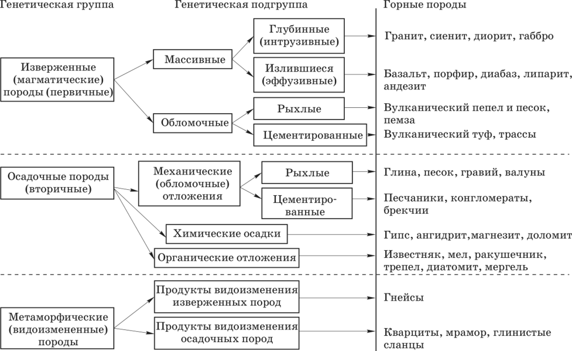

## Классификатор 
##<h4> В данной программе реализована простая сверточная сеть, написанная на tensor_flow с чатботом для telegram
##<h3> целью работы является ~~сдача экза~~ классификация изображений, полученных от пользователя telegram собеседника.

##<h4>Телеграм бот - @frameStoneBot
##<h4>Писать гадости - Elo.1972@yandex.ru

##<H3>Assumption </H3>
## На картинке ниже показаны основные подгруппы по которым классифицируются породы 
## UPD: окей окей это имеет смысл. Будут сл классы :
## <ol>
## <li>Гранит</li>
## <li>Песок</li>
## <li>Базальт</li>
## <li>Туф</li>
## <li>Гипс</li>
## <li>Гнейсы</li>
## <li>Мрамор</li> </ol>
##(внешне похожие, но разные по структуре и другим физ. качествам)

